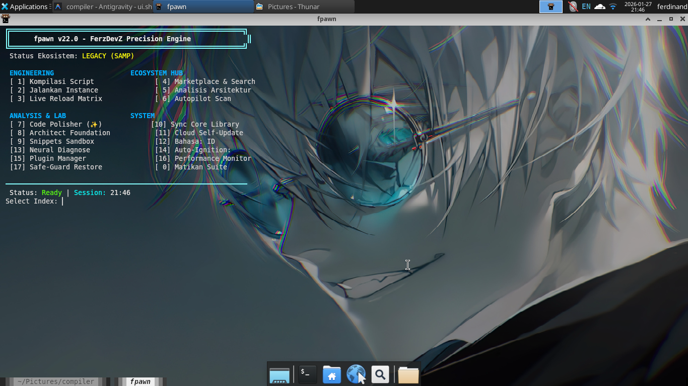

# FPAWN PRO v33.0: THE OMNIPOTENT DEVELOPMENT SUITE 🦾💎

**Professional Development Environment for Pawn Scripting | SAMP & Open.MP**

---

## 🗺️ Navigation
- [**English Version**](#english-professional-manual)
- [**Indonesian Version**](#panduan-profesional-bahasa-indonesia)

---

<a name="english-professional-manual"></a>
# [EN] THE ULTIMATE PAWN DEVELOPMENT INFRASTRUCTURE

### ♾️ Prologue: The Vision
FPAWN Pro is a proprietary, high-performance development infrastructure meticulously engineered for advanced Pawn scripting. It transcends the limitations of traditional compilers by unifying static analysis, real-time server telemetry, and secure hot-deployment into a single, cohesive command-center. 

Designed for scalability and precision, this suite represents the pinnacle of modern SAMP/Open.MP development tools.



---

## 🖋️ Chapter I: Installation & Global Deployment

### 1.1 Cross-Platform Deployment
FPAWN Pro is built to be environment-agnostic. Use the provided automated scripts to initialize the core engine.

#### **Linux (Ubuntu, Debian, Arch, RHEL)**
The unified shell installer handles compilation, permissions, and PATH registration.
```bash
chmod +x install.sh
./install.sh
```

#### **Windows (PowerShell 5.1+)**
The professional setup script registers the executable to the User environment variables.
```powershell
Set-ExecutionPolicy RemoteSigned -Scope CurrentUser
.\setup.ps1
```

### 1.2 Binary Verification
After installation, verify the proprietary core by running:
```bash
fpawn --version
```

---

## 🏛️ Chapter II: The 8 Pillars of Mastery

### I. Hybrid Matrix Build Engine
A parallel compilation architecture that leverages multi-threading to achieve build speeds up to 5x faster than conventional methods.
- **Incremental Intelligence**: The engine detects file-state changes and only recompiles modified resources.

### II. Semantic Analytics Core
A deep-learning inspired static analyzer that monitors the entire lifecycle of your script's variables.
- **Leak Detection**: Identifies unclosed file handles and database connections.
- **Zombie Analysis**: Pinpoints assigned variables that have zero influence on the script's logic.

### III. Forensic Debugging Module
Automated crash and log analysis.
- **Crash Localization**: Parses `server_log.txt` to map offsets back to your source code lines.
- **Logic Tracing**: Provides human-readable descriptions of runtime failures.

### IV. The Scribe (Autonomous Documentation)
Generates high-fidelity API documentation (`DOCS_PROJECT.md`) by parsing native definitions, callbacks, and specialized doc-comments in your code.

### V. Ignition Pro (High-Speed Deploy)
Secure synchronization between local development and VPS production via SCP/SSH.
- **Atomic Deployment**: Ensures no partial uploads occur during server updates.

### VI. The Pulse (Telemetry Dashboard)
Real-time server health monitoring.
- **System Metrics**: Visualizes CPU usage, memory consumption, and player count via live ASCII charts.

### VII. The Nexus (Dependency Mapping)
Recursive analysis of your `#include` chain.
- **Conflict Resolution**: Detects circular dependencies and redundant declarations.

### VIII. The Alchemist (Smart Dependency Resolver)
Intelligent plugin management.
- **Recursive Fetching**: Automatically resolves and installs plugin dependencies (e.g., MySQL requires sscanf).

---

## ⚙️ Chapter III: Master Control & Central Configuration
Access the persistent configuration engine via Index **[37]**.

- **Neural Sensitivity**: Fine-tune the static analyzer's aggressiveness.
- **Theme Engine**: Choose between **Satoru Blue**, **Master Gold**, **Sukuna Red**, and **Stealth Dark**.
- **Cloud Interface**: Manage SSH profiles and Discord webhooks for real-time build notifications.

---

<a name="panduan-profesional-bahasa-indonesia"></a>
# [ID] INFRASTRUKTUR PENGEMBANGAN PAWN TERBAIK

### ♾️ Prolog: Visi Keunggulan
FPAWN Pro adalah infrastruktur pengembangan eksklusif berperforma tinggi yang dirancang khusus untuk skrip Pawn tingkat lanjut. Sistem ini melampaui batasan compiler tradisional dengan menyatukan analisis statis, telemetri server real-time, dan deployment jarak jauh yang aman ke dalam satu pusat kendali yang terpadu.

Dibuat untuk skalabilitas dan presisi, suite ini mewakili puncak dari alat pengembangan modern untuk SAMP/Open.MP.

---

## 🖋️ Bab I: Instalasi & Deployment Global

### 1.1 Deployment Lintasan Platform
FPAWN Pro dirancang agar kompatibel dengan berbagai OS. Gunakan script otomatis berikut untuk inisialisasi engine utama.

#### **Linux (Ubuntu, Debian, Arch, RHEL)**
Jalankan shell installer untuk menangani kompilasi, perizinan, dan registrasi PATH.
```bash
chmod +x install.sh
./install.sh
```

#### **Windows (PowerShell 5.1+)**
Gunakan script setup profesional untuk mendaftarkan executable ke environment variabel pengguna.
```powershell
Set-ExecutionPolicy RemoteSigned -Scope CurrentUser
.\setup.ps1
```

---

## 🏛️ Bab II: 8 Pilar Keunggulan Teknologi

### I. Engine Build Matriks Hibrida
Arsitektur kompilasi paralel yang memanfaatkan multi-threading untuk mencapai kecepatan build hingga 5x lebih cepat dari metode konvensional.

### II. Inti Analisis Semantik
Penganalisis statis yang memantau seluruh siklus hidup variabel dalam skrip Anda.
- **Deteksi Kebocoran**: Mengidentifikasi file handle atau koneksi database yang tidak ditutup.
- **Analisis Zombie**: Menemukan variabel yang tidak memiliki pengaruh pada logika skrip (mubazir).

### III. Modul Debugging Forensik
Analisis otomatis terhadap crash dan log server.
- **Lokalisasi Crash**: Memetakan offset dari `server_log.txt` kembali ke baris kode sumber Anda.

### IV. The Scribe (Dokumentasi Otonom)
Menghasilkan dokumentasi API berkualitas tinggi secara otomatis dengan memparsing fungsi, callback, dan komentar teknis.

### V. Ignition Pro (Deployment Kecepatan Tinggi)
Sinkronisasi aman antara pengembangan lokal dan VPS produksi melalui protokol SCP/SSH.

### VI. The Pulse (Dashboard Telemetri)
Pemantauan kesehatan server real-time dengan grafik ASCII live yang dinamis.

### VII. The Nexus (Pemetaan Dependensi)
Analisis rekursif pada rantai `#include` untuk mendeteksi konflik dependensi dan deklarasi redundan.

### VIII. The Alchemist (Penyelesai Dependensi Cerdas)
Manajemen plugin cerdas yang secara otomatis menyelesaikan dan menginstal dependensi yang dibutuhkan secara rekursif.

---

## ⚙️ Bab III: Master Control & Konfigurasi Pusat
Akses engine konfigurasi permanen melalui Indeks **[37]**.

- **Sensitivitas Neural**: Atur agresivitas penganalisis statis.
- **Engine Tema**: Pilih antara tema **Satoru Blue**, **Master Gold**, **Sukuna Red**, dan **Stealth Dark**.
- **Antarmuka Cloud**: Kelola profil SSH dan webhook Discord untuk notifikasi build real-time.

---

## 🤝 Contribution & Support
Project ini dikelola oleh **FerzDevZ**. Jika Anda menemukan issue teknis atau memiliki saran pengembangan, silakan buka Issue di GitHub repository ini.

**© 2026 FerzDevZ Proprietary Software. All Rights Reserved.**
